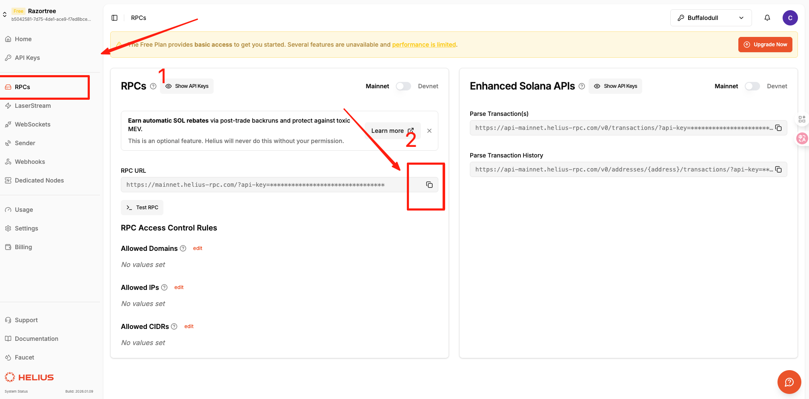

# Task1 学习记录，本地部署和测试

### 创建task1 工程
- 命令行创建
``` bash
mkdir task1
cd task1
```

- 也可手动创建该文件夹，再进入终端

### 工程初始化
- 在终端上运行
```bash
npm i -D typescript ts-node @types/node
```
 安装项目所需要的库

```bash
npm i @solana/web3.js @solana/spl-token bs58 dotenv
```

- 文档配置
  

配置 package.json,在里面添加
```
  "type": "module",
  "scripts": {
    "mint": "node mint.ts"
  },
```


配置tsconfig.json
```
    "types": ["node"]
```

### 编写代码

- 在目录下创建 `.env`
```
RPC_ENDPOINT=https://api.devnet.solana.com
SECRET=你的私钥
```

- 使用`web3.js` 铸造一个 SPL Token代码
- 在`blueshift`上提交代码时，去掉 `import "dotenv/config";`
- 创建 `minit.ts` 文件，编写代码
```typescript
import {
  Keypair,
  Connection,
  sendAndConfirmTransaction,
  SystemProgram,
  Transaction,
} from "@solana/web3.js";

import {
  createAssociatedTokenAccountInstruction,
  createInitializeMint2Instruction,
  createMintToCheckedInstruction,
  getAssociatedTokenAddressSync,
  getMinimumBalanceForRentExemptMint,
  MINT_SIZE,
  TOKEN_PROGRAM_ID,
  ASSOCIATED_TOKEN_PROGRAM_ID,
} from "@solana/spl-token";
import "dotenv/config";

import bs58 from "bs58";
console.log("RPC_ENDPOINT =", process.env.RPC_ENDPOINT);

const feePayer = Keypair.fromSecretKey(
  bs58.decode(process.env.SECRET || "")
);

const connection = new Connection(process.env.RPC_ENDPOINT || "", "confirmed");

async function main() {
  try {
    const mint = Keypair.generate();
    const mintRent = await getMinimumBalanceForRentExemptMint(connection);

    // 1) Create mint account (SystemProgram.createAccount)
    const createAccountIx = SystemProgram.createAccount({
      fromPubkey: feePayer.publicKey,
      newAccountPubkey: mint.publicKey,
      space: MINT_SIZE,
      lamports: mintRent,
      programId: TOKEN_PROGRAM_ID,
    });

    // 2) Initialize mint (decimals=6, mintAuthority=feePayer, freezeAuthority=feePayer)
    const decimals = 6;
    const initializeMintIx = createInitializeMint2Instruction(
      mint.publicKey,
      decimals,
      feePayer.publicKey,
      feePayer.publicKey,
      TOKEN_PROGRAM_ID
    );

    // 3) Create ATA for feePayer
    const associatedTokenAccount = getAssociatedTokenAddressSync(
      mint.publicKey,
      feePayer.publicKey,
      false,
      TOKEN_PROGRAM_ID,
      ASSOCIATED_TOKEN_PROGRAM_ID
    );

    const createAssociatedTokenAccountIx = createAssociatedTokenAccountInstruction(
      feePayer.publicKey,          // payer
      associatedTokenAccount,       // ata
      feePayer.publicKey,          // owner
      mint.publicKey,              // mint
      TOKEN_PROGRAM_ID,
      ASSOCIATED_TOKEN_PROGRAM_ID
    );

    // 4) Mint 21,000,000 tokens to ATA (checked)
    const mintAmount = BigInt(21_000_000) * BigInt(10 ** decimals);

    const mintToCheckedIx = createMintToCheckedInstruction(
      mint.publicKey,              // mint
      associatedTokenAccount,       // destination
      feePayer.publicKey,          // authority (mintAuthority)
      mintAmount,                  // amount (base units)
      decimals,                    // decimals
      [],                          // multiSigners
      TOKEN_PROGRAM_ID
    );

    const recentBlockhash = await connection.getLatestBlockhash("confirmed");

    const transaction = new Transaction({
      feePayer: feePayer.publicKey,
      blockhash: recentBlockhash.blockhash,
      lastValidBlockHeight: recentBlockhash.lastValidBlockHeight,
    }).add(
      createAccountIx,
      initializeMintIx,
      createAssociatedTokenAccountIx,
      mintToCheckedIx
    );

    // 5) Signers: feePayer pays + signs mintTo authority, mint signs account creation
    const transactionSignature = await sendAndConfirmTransaction(
      connection,
      transaction,
      [feePayer, mint]
    );

    console.log("Mint Address:", mint.publicKey.toBase58());
    console.log("ATA Address:", associatedTokenAccount.toBase58());
    console.log("Transaction Signature:", transactionSignature);
  } catch (error) {
    console.error(`Oops, something went wrong: ${error}`);
  }
}

main();

```

### 运行代码和在浏览器中查看
如果是本地的查看不了，需要第三方或者官方的`RPC`才能查看

- 运行
```bash
npm run mint 
```

- 结果
```bash
╰─> npm run mint


> mint
> node mint.ts

Mint Address: 5z4XkA99Ez44z2zyAbVYuCChCxXYWxHfW9MxTJWXo5ZG
ATA Address: 5Eo78Smqt7jP61rTjCr7n9H4o96DHVTQN891AEXpzS7X
Transaction Signature: 5ucFAj3UAnYtA8LEAwqq9jR1RmsDWayyKSQLpY5PhZz7fqHSR11ya3KxMGbixn2ahaeSkndnNY8NzwT1oYBwb49N
```

- 在浏览器里看（devnet）

脚本打印 tx 后直接打开：

`https://explorer.solana.com/tx/<tx>?cluster=devnet`

`https://explorer.solana.com/address/<mint>?cluster=devnet`

`https://explorer.solana.com/address/<ata>?cluster=devnet`


## 常见问题：
###  一、 .env 文件
#### 1. `SECRET` 如何获取？
- 在终端中运行获取

```bash
node --input-type=module -e "import fs from 'fs'; import os from 'os'; import bs58 from 'bs58'; const p=os.homedir()+'/.config/solana/id.json'; const arr=Uint8Array.from(JSON.parse(fs.readFileSync(p,'utf8'))); console.log(arr.length); console.log(bs58.encode(arr));"
```
#### 2. `RPC_ENDPOINT` 如何填写
(1) 官方的`RPC`节点
- 链接：`https://api.devnet.solana.com`
- 缺点：慢，提交超时等


(2) 本地节点
- 需要在终端运行`solana-test-validator --reset`
- 链接：`http://127.0.0.1:8899`
- 缺点：无法在浏览器中查看
- 需要在运行配置，改配置，获取`solana`
```
solana config set --url http://127.0.0.1:8899
solana airdrop 10
solana balance
```

(3) 第三方节点
- 官网：`https://www.helius.dev/`
- 使用 `谷歌`、`Github`、`钱包` 登录
- 复制 `RPC` 节点

- 需要在运行配置，改配置，获取`solana`
```bash
solana config set --url 复制的节点链接
solana airdrop 1
solana balance
```